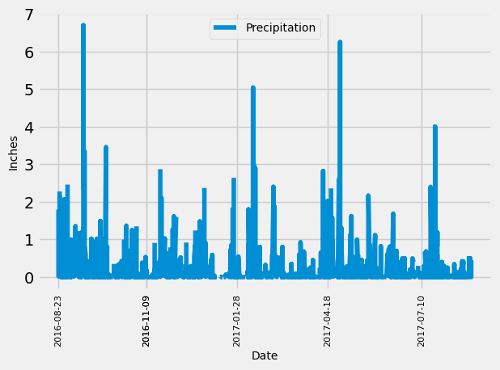
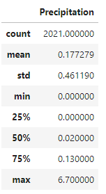
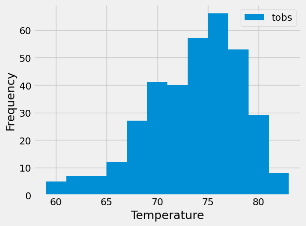

**SQLALCHEMY CHALLENGE**

**(1) Project Overview and Purpose:**

This exercise will result in a climate analysis, which can assist with trip planning. Precipitation and location information will be used to analyze potential locales for a vacation, while an app will be research weather conditions quickly.

**(2) Dataset Description:**

The "hawaii.sqlite" file contains the precipitation and location (station) information.

The "hawaii_measurements.csv" file contains station identification; dates; and observed precipitation (prcp) and temperature (tobs) values

The "hawaii_stations.csv" file contains station identification and name; coordinates (latitude and longitude); and elevation measurements.

**(3) Data Cleaning and Preprocessing:**

The tables of the "hawaii.sqlite" file were reflected into SQLAchemy Object Relational Mapper.

The tables did not required cleaning for any missing or partially available information.

**(4) Data Visualization Techniques:**

The climate analysis resulted in two bar charts and a summary statistics table.

The app resulted in displaying responses to queries in a .html format, which could be viewed in a brower window (i.e., Google Chrome) at an address like http://127.0.0.1:5000/api/v1.0/precipitation.

**(5) Results and Analysis:**

(a) For the climate analysis-

(i) A plot of the precipitation analysis, the cumulative rainfall in inches for twelve (12) months between August 2016 and August 2017 was plotted with Date as the x-axis:

(ii) A summary of precipitation statistics in tabular form:

(iii) A histogram of the frequency of observations at Station USC00519281 for the temperatures measured over a twelve (12) month period

(b) Climate app-

The user can use the "app_roop.py" file to query and generate responses to specific lines of inquiry:

(i) API Static Route that for precipitation, returns json with the date as the key and the value as the precipitation and only returns the jsonified precipitation data for the last year in the database

(ii) API Static Route that returns jsonified data of all of the stations in the database

(iii) API Static Route that returns jsonified data for the most active station (USC00519281) and only returns the jsonified data for the last year of data (3 points)

(iv) API Dynamic Routes that-

- A start route that accepts the start date as a parameter from the URL and returns the min, max, and average temperatures calculated from the given start date to the end of the dataset (4 points)

- A start/end route that accepts the start and end dates as parameters from the URL and returns the min, max, and average temperatures calculated from the given start date to the given end date (6 points)

**(6) Ethical Considerations:**

The data used for this exercise does not contain information that is unavailable elsewhere or is formatted in a different way. There are no sensitivity concerns for the dataset.

**(7) Instructions for Interacting with the Project:**

Code is available within two files, "climate_roop.ipynb" and "app_roop.py" within the **surfs_up** folder.

Plots and the table are filed within the **Output** folder.

Data is stored in the "hawaii.sqlite"; hawaii_measurements.csv"; and "hawaii_stations.csv" files within the **Resources** folder.

To use the Static and Dynamic Routes, use the code in combination with a brower (i.e., Google Chrome)

**(8) Citations:**

(a) Axis ticks. (2024). Retrieved from https://matplotlib.org/stable/users/explain/axes/axes_ticks.html#sphx-glr-users-explain-axes-axes-ticks-py/

(b) Instructor assistance via Office Hours (06-Jun-2024) regarding sqlite file location and availability for Climate App exercise

(c) Tutoring session (09-Jun-2024):

(i) Discussion on student's code needed for API Dynamic Route exercise for both (1) start date only and (2) start date + end date scenarios

(ii) Confirmation of np.ravel usage within Climate App code

(d) Several questions asked of Xpert Learning Assistant on the following topics:

(i) Using np.ravel for both correcting a histogram plot of the temperature data and applying to results to generate a one-dimensional (1D) list

(ii) Questions regarding availability of sqlite file for code (following from noted Instructor assistance above, #2)

(iii) Learning how to properly enter (1) start and (2) start + end dates in browser address for the Climate App exercise

(iv) Assistance with correcting syntax when errors where identified

(v) Other general code-related questions

